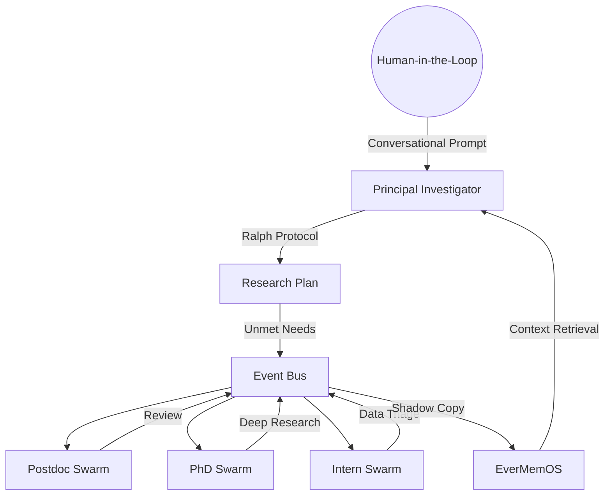

# Nova Researcher: Autonomous Cross-Discipline Discovery Swarm

Nova Researcher is a state-of-the-art autonomous research lab powered by a hierarchical multi-agent swarm. It integrates the latest paradigms in AI-driven science to bridge the gap between disparate scientific domains.

## 🧬 Scientific Foundation

Nova Researcher is built upon three pillar technologies:
1.  **AI Scientist v2 (Sakana AI):** Implements Agentic Tree Search for hypothesis generation, red-teaming, and iterative refinement.
2.  **OpenAI Deep Research:** Powers the specialized "Burst" mode for exhaustive literature mining and evidence synthesis.
3.  **EverMemOS (EverMind-AI):** Provides a local "Memory Operating System" for infinite context retention, allowing agents to manage research datasets that exceed standard LLM context windows.

## 🏛️ Architecture



## 🛠️ Features

### 1. Hierarchical Swarm
The lab dynamically scales its workforce based on available computational resources (Postdocs > PhDs > Interns).
- **Postdocs:** Quality control and Peer Review.
- **PhD Students:** Core technical research and Literature Search.
- **Interns:** Data formatting and initial triage.

### 2. Ralph Protocol (Iterative Development)
Inspired by [Ralph Workflow](https://github.com/gbp10/ralph-workflow), every agent follows an autonomous loop:
**Read → Plan → Execute → Verify → Cycle**. No task is marked complete until it passes internal verification.

### 3. Human-in-the-Loop (HITL) Steering
The lab features an interactive command-line interface (`start_lab.py`) that allows humans to:
- `/status`: Monitor the 4-stage research plan.
- `/steer`: Inject real-time directives into the active swarm.
- `/question`: Query the PI for mid-sprint analysis.

## 🚀 Getting Started

1.  **Initialize the Research:**
    ```bash
    python main.py
    ```
    Enter a rich, conversational prompt about your cross-disciplinary interest.

2.  **Command the Lab:**
    ```bash
    python start_lab.py
    ```
    Steer your agents as they navigate the research frontier.

## 📚 References
- Sakana AI: *The AI Scientist: Towards Fully Automated Scientific Discovery*
- OpenAI: *Deep Research Methodology for Contextual Synthesis*
- EverMind-AI: *EverMemOS - Infinite Context Memory Management*
- Ralph Workflow: *Self-referential AI development loops*

---
*Created by the Antigravity Agent for gauravshajepal-hash.*
